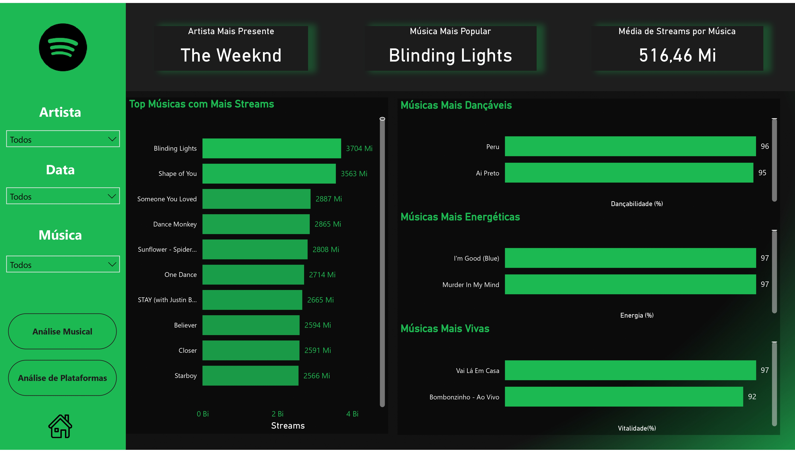
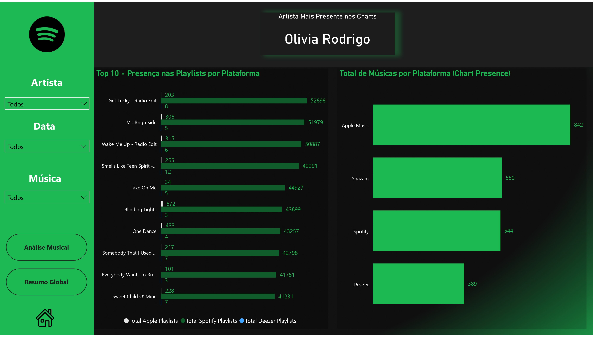
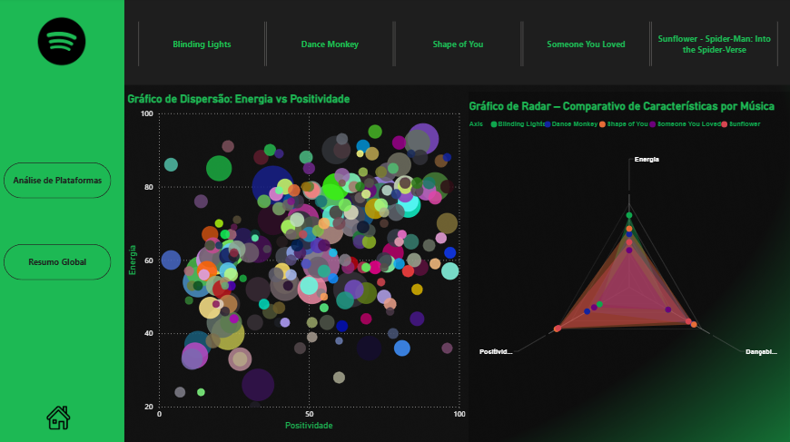

# 🎧 Spotify Dashboard 2023 – Power BI

Este projeto foi desenvolvido como parte da minha jornada para a área de **Análise de Dados**. Utilizando um conjunto de dados do Spotify com as músicas mais populares de 2023, criei um dashboard com foco em visualização, KPIs e interatividade.

---

## 🎯 Objetivo
- Aplicar técnicas de visualização e análise de dados
- Treinar habilidades em Power BI, DAX, filtros e interações
- Criar um projeto real para compor meu portfólio profissional

---

## 🧩 Ferramentas Utilizadas
- Power BI (Medidas DAX, gráficos personalizados, design temático)
- Dataset: [Top Spotify Songs 2023 - Kaggle](https://www.kaggle.com/datasets/nelgiriyewithana/top-spotify-songs-2023)

---

## 🧠 KPIs e Métricas
- Artista mais presente nas playlists
- Música mais popular (streams)
- Média de streams por música
- Músicas mais dançantes, energéticas e "vivas"
- Comparativo por plataforma (Spotify, Apple Music, Deezer, Shazam)
- Análise musical por características sonoras (valência, energia, etc.)

---

## 📊 Estrutura do Dashboard

### 🔹 Página 1 – Resumo Global

- Top 10 músicas com mais streams
- KPIs principais
- Músicas mais dançantes, energéticas e vivas
- Filtros por artista, data e música

---

### 🔹 Página 2 – Análise de Plataformas

- Top 10 músicas com maior presença em playlists por plataforma
- Total de músicas presentes nas principais plataformas (Apple, Spotify, Deezer, Shazam)
- Artista mais presente nos charts

---

### 🔹 Página 3 – Análise Musical

- Gráfico de dispersão: Energia vs Positividade (valência)
- Gráfico de radar com comparação entre músicas populares:
  - *Blinding Lights*
  - *Dance Monkey*
  - *Shape of You*
  - *Someone You Loved*
  - *Sunflower - Spider-Man: Into the Spider-Verse*

---

## 🧠 Aprendizados

Este projeto me ajudou a:
- Dominar recursos visuais do Power BI
- Trabalhar com medidas DAX, rankings e filtros dinâmicos
- Explorar temas reais com dados ricos
- Desenvolver uma apresentação clara e interativa para o portfólio

---

## 🌐 Links

- [🔗 Meu LinkedIn](https://www.linkedin.com/in/lhenriqls)

---

> Projeto criado por Luiz Henrique.
